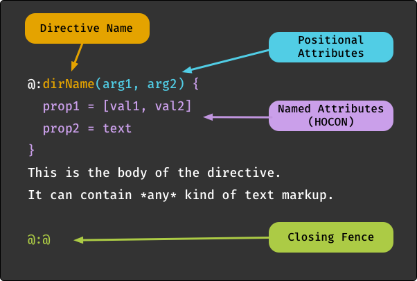
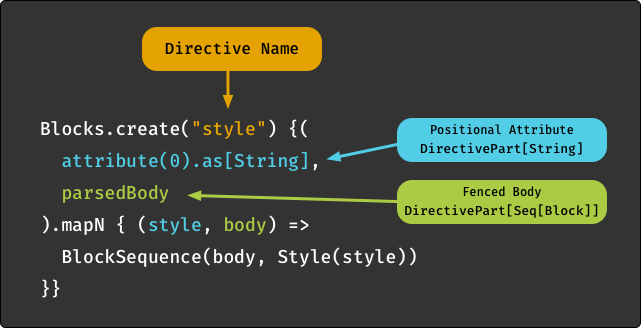

Implementing Directives
=======================

Implementing a directive is one of two possible ways to extend the syntax of a text markup language.

The second option is @ref:(Writing Parser Extensions), but in many cases the directive approach offers more convenience.
It is based on a common syntax for declaring a directive and its attributes and body elements.
Therefore directives can be implemented without writing a custom parser and without getting familiar
with Laika's parser combinators.

There are usually only two scenarios where you may prefer to write a parser extension instead:

* You have very special requirements for the syntax. 
  If, for example, you want to design a new table markup format, 
  this is quite impossible to express with the fixed syntax of a directive.

* You want the most concise syntax for elements that are used frequently. 
  One example is to support short references to issues in a ticket system in the format `#123`.
  The shortest syntax that is possible with directives would be something like `@:ticket(123)` 
  which you may still find too verbose.


Anatomy of a Directive
----------------------

The following diagram shows a markup directive with all its optional elements present:



It is quite abstract and contrived, because any real-world directive would not use all optional elements at once.

Let's discuss the directive parts one by one:

* The **directive name** part consists of the character sequence `@:` followed by an alphanumeric name.
  It is the only required part, and in fact some of the built-in directives of the library like `@:pageBreak`
  do not accept any attributes or body elements. The convention is that directive names are camel case.
  Their main task is to link the markup to the corresponding directive implementation.
  
* [Positional Attributes] can follow the name declaration. 
  They are enclosed in parentheses and contain a comma-separated list of values,
  mimicking the syntax of function invocations.
  
  They are best suited for directives that either accept a single attribute or a list of attributes of the *same type*.
  An example would be a list of style names to apply to the body.
  For multiple attributes with different types and meanings, it is recommended to use named attributes instead.
  
* [Named Attributes (HOCON)] can follow the name declaration and the optional positional attributes.
  They are enclosed in braces `{` and `}` as HOCON is a superset of JSON.
  
  They offer the full flexibility of the HOCON standard, like nested keys, array elements and substitution references
  (`${...}`) which allow markup authors to refer to any variable in page/directory/global configuration when
  defining an attribute.
  
* The [Directive Body] can follow the name declaration and any optional attribute blocks. 
  It is a region of regular markup content demarcated by a closing fence `@:@`.
  With block directives the closing fence has to be placed on an otherwise empty line,
  with all other directive kinds it can appear anywhere.

  The author of a directive implementation can decide whether the body part should be processed as a raw string,
  or as pre-parsed AST nodes. 
  In the latter case the type of the body passed to the implementation will be `Seq[Span]`, `Seq[Block]` or
  `Seq[TemplateSpan]`, depending on the type of the directive.
  
Finally, let's also examine the anatomy of a directive implementation:



We'll go through this line by line:

* The imports you need depend on the directive type, you need to choose the matching DSL which is either
  `Blocks.dsl._`, `Spans.dsl._` or `Templates.dsl._`.
  You also need `cats.implicits._` for the convenient `mapN` method.
  
* The entry point for creating a directive again depends on the type, it's either
  `Blocks.create`, `Spans.create` or `Templates.create`.
  The string passed to this method is the name of the directive without the leading `@:`.
  
* Next you need to declare the directive parts that you expect, whether they are required or optional,
  and which type they should be converted to. There are combinators for [Directive Attributes],
  [Directive Body], [Access to the Parser] and [Access to the Document Cursor].
  
* Finally you pass the function the engine should invoke after validating and converting all expected directive parts.

  The function will not be invoked at all in case of missing required parts or type conversion errors,
  instead an invalid node will inserted into the AST which will be handled 
  depending on your [Error Handling] configuration.
  This makes it quite convenient for directive authors as it removes a lot of boilerplate.
  
  When the directive is valid, the parameters of the function will be of the type matching your spec,
  in our example `String` and `Seq[Block]`. 
  The value the directive function produces must be an AST node matching the type of the directive, 
  `Span`, `Block` or `TemplateSpan`.

Further below we'll show a [Sample Directive] based on a real world scenario.


Directive Types
---------------

Due to differences in the node types they produce and the location they are allowed to appear in, 
there is a distinction between seven directive types:

* **Template Directives** that can be used anywhere in templates, which produce `TemplateSpan` elements.
* **Block Directives** for block elements in markup, which produce `Block` elements.
* **Span Directives** for inline elements in markup, which produce `Span` elements.
* 3 types of [Separator Directives] which can be used to separate the body elements 
  of any of the other three directive types and can produce any kind of result type.
* [Link Directives], a special type of span directives providing shortcuts for directives that
  produce link nodes.

If you want to create a directive that can be used in all three locations 
you can usually easily reuse parts of your logic.
If your directive version for inline elements generates a simple `SpanLink` node for example,
you can wrap that same node in a `Paragraph` block node for a block-level directive.

The three main directive types for blocks, spans and templates are similar enough that we avoid
the repetition of documenting them separately. 
Instead the following sections [Sample Directive], [Directive Attributes], [Directive Body],
[Access to the Parser] and [Access to the Document Cursor] apply to all of these 3 main types.

[Separator Directives] and [Link Directives] on the other hand are quite different,
which is why they come with their own documentation section.


Directives Provided by Laika
----------------------------

Even though this chapter is about implementing your own directives, 
it's worthwhile to briefly mention that Laika comes with a handful of directives out of the box.

First you might want to avoid to reinvent the wheel and ensure the directive idea you had is not already covered.
Secondly you could look at the existing directive implementations as examples and guidelines for creating your own.

All available directives are documented in the chapter [Standard Directives], 
their source code can be found [here][directive-api]

[directive-api]: https://github.com/planet42/Laika/blob/master/core/src/main/scala/laika/directive/StandardDirectives.scala


Sample Directive
----------------

Like in the [Writing Parser Extensions] chapter our example implementation is going to provide a shortcut 
for a reference to a ticket system via its number. 
While the custom parser did this with the concise syntax `#123`,
a directive has to stick to the standard directive syntax, for which we'll pick `@:ticket(123)`.


### Directive Implementation

Let's walk through the implementation of our little ticket directive:

```scala
import Spans.dsl._

val ticketDirective = Spans.create("ticket") {
  attribute(0).as[Int].map { ticketNo => 
    SpanLink(Seq(Text("#" + num)), ExternalTarget(s"http://our-tracker.com/$num"))
  }
}
```

* With `Spans.create("ticket")` we specify the name of the directive without the leading `@:` prefix.

* `attribute(0)` specifies a single, positional attribute (which has to appear between parenthesis).
  See [Directive Attributes] for an overview of all the other options.

* `as[Int]` converts the attribute to an Int before passing it to the directive. 
  When the attribute is missing or not a valid integer, the directive fails and the function passed to `map`
  will never be invoked
  There is a range of decoders that you can use out of the box, but you can also provide your own `ConfigDecoder`.
  
* We are not calling `.optional` on the specified attribute, which means it is mandatory by default and the
  directive will fail if the user omits it (e.g. by just typing `@:ticket`).
  
* We finally create a `SpanLink` node (which implements `Span`) as the result.
  We use `# + num` as the link text and then build the URL as an external target.

This first example hard-codes the base URL. If your directive is for internal use, this may not be a problem.
But if you require a configurable base URL, we later show an enhanced example that has access to the configuration.


### Directive Registration

For bundling all your Laika directives, you need to extend `DirectiveRegistry`.
This is a sub-trait of `ExtensionBundle`.

For our case we only need to register our ticket directive, which is a span directive: 

```scala
object MyDirectives extends DirectiveRegistry {
  val spanDirectives = Seq(ticketDirective)
  val blockDirectives = Seq()
  val templateDirectives = Seq()
  val linkDirectives = Seq()
}
```

Finally we need to register our registry together with any built-in extensions you may use:

@:choices(config)

@:choice(sbt)
```scala
laikaExtensions := Seq(
  GitHubFlavor,
  MyDirectives
)
```

@:choice(library)
```scala
val transformer = Transformer
  .from(Markdown)
  .to(HTML)
  .using(GitHubFlavor)
  .using(MyDirectives)
  .build
```
@:@

We can now use our `ticket` directive in Markdown or reStructuredText files!


### Access to Configuration

This will enhance the previous example by making the base URL configurable.

One of the combinators we can use when defining the directive can ask for a document cursor to be
provided alongside the expected attribute value:

```scala
import Spans.dsl._

val ticketDirective = Spans.create("ticket") {
  (attribute(0).as[Int], cursor).mapN { (ticketNo, cursor) => 
    cursor.config.get[String]("ticket.baseURL").fold(
      error => InvalidElement(s"Unable to read base URL for tickets: $error", "#" + num).asSpan,
      baseURL => SpanLink(Seq(Text("#" + num)), ExternalTarget(s"$baseURL$num"))
    )
  }
}
```

The `DocumentCursor` instance passed to our function provides access to the project configuration which we use
in this example, but also to all ASTs of the input tree, including other documents. 
It can therefore be used for advanced functionality like producing a table of contents.

The API of the `cursor.config` property is documented in @:api(laika.config.Config).

In our case we expect a string, but we also need to handle errors now, as the access might fail
when the value is missing or it's not a string. 
We return an `InvalidElement` for errors, which is a useful kind of AST node as it allows the user to control the
error handling. 
The presence of such an element will by default cause the transformation to fail with the provided error message
shown alongside any other errors encountered.
But users can also switch to a "visual debugging" mode by rendering all errors in place. 
See [Error Handling] for details. 

With this change in place, the user can now provide the base URL in the builder of the `Transformer`:

@:choices(config)

@:choice(sbt)
```scala
laikaConfig := LaikaConfig.defaults
  .withConfigValue("ticket.baseURL", "https://example.com/issues")
```

@:choice(library)
```scala
val transformer = Transformer
  .from(Markdown)
  .to(HTML)
  .using(GitHubFlavor)
  .withConfigValue("ticket.baseURL", "https://example.com/issues")
  .build
```
@:@


The registration steps are identical to the previous example.


Directive Attributes
--------------------

You can use two types of attributes: 
positional attributes between parenthesis, and named attributes in the HOCON format between curly braces.

See [Anatomy of a Directive] for an overview and a full syntax example.


### Positional Attributes

Positional attributes can follow the name declaration. 
They are enclosed in parentheses and contain a comma-separated list of values,
mimicking the syntax of function invocations.

They are best suited for directives that either accept a single attribute or a list of attributes of the *same type*.
An example would be a list of style names to apply to the body.
For multiple attributes with different types and meanings, it is recommended to use named attributes instead.

Markup example:

```laika-html
@:format(html, epub)
```

Combinators:

* `attribute(Int)` for accessing a single attribute, e.g. `attribute(0)` for the first.
  Like with named attributes, you can turn them into [Optional Attributes] or apply [Type Conversions].
  
* `positionalAttributes` for accessing all positional attributes as a list of values.
  Applying a type conversion like `.as[Int]` in this case changes the result to be `Seq[Int]`.
  
Combinator Example:

```scala
val ticketDirective = Spans.create("directive-name") {
  attribute(0).as[Int].map { ticketNo => 
    ??? // produce AST span node
  }
}
```


### Named Attributes (HOCON)

Named Attributes in HOCON format can follow the name declaration and the optional positional attributes.
They are enclosed in braces `{` and `}` as HOCON is a superset of JSON.
  
They offer the full flexibility of the HOCON standard, like nested keys, array elements and substitution references
(`${...}`) which allow markup authors to refer to any variable in page/directory/global configuration when
defining an attribute.

Markup example:

```laika-html
@:image { width = 280px, height = 220px }
```

Combinators:

* `attribute(String)` for accessing a single attribute by name, e.g. `attribute("width")` for the `width` attribute 
  in our example.
  Like with positional attributes, you can turn them into [Optional Attributes] or apply [Type Conversions].
  
* `allAttributes` for accessing all attributes as a HOCON `Config` instance, Laika's configuration API.
  This way you can manually inspect the values it contains. 
  This naturally leaves the burden of validation and error handling (e.g. for required values or type conversions)
  with the implementor of the directive. 
  It should therefore only be used when this level of flexibility is really required.
  See @:api(laika.config.Config) for the API documentation.
  
Combinator Example:

We'll use the `allAttributes` combinator together with the one for accessing body elements:

```scala
val directive = Spans.create("custom") {
  (allAttributes, parsedBody).mapN { (attributes, bodyContent) => 
    val path = attributes.getOpt[Path]("filePath")
    val index = attributes.getOpt[Int]("index")
    ??? // produce AST span node
  }
}
```


### Optional Attributes

Positional and named attributes can be marked as optional.

Combinator Example:

```scala
attribute("width").as[Int].optional
```

The parameter type of your directive function changes accordingly,
from `T` to `Option[T]` where `T` is either the type returned by your converter (see below) or the default type.


### Type Conversions

You can specify a decoder for all attributes with the `as[T]` method:

```scala
attribute("depth").as[Int].optional
```

Without a decoder the result type would be `ConfigValue` which is a data structure similar to those 
of popular JSON libraries.
But that type is rarely the most convenient type, which is why Laika defines some basic decoders out of the box, 
for `String`, `Int`, `Double`, `Boolean`, `Date` and `Path` as well as `Seq` and `Map` of containing these types.

The decoders will cause a directive to fail in case a type conversion does not succeed.

You can define your own by implementing `ConfigDecoder[T]`.


### Inheritance

By default directives only accept attributes defined right in the attribute section of the directive 
to avoid name clashes with attributes in other scopes. 
If you want to explicitly enable inheritance, so that a user can define default values for attributes 
either programmatically in the global configuration or in headers of the markup or template files,
you can set the `inherited` flag:

Combinator Example:

```scala
attribute("width").as[Int].inherited
```

With this flag set, the `width` attribute can be inherited from other scopes 
if it is not defined in the directive itself.


Directive Body
--------------

A directive body can follow the name declaration and any optional attribute blocks. 
It is a region of regular markup content demarcated by a closing fence `@:@`.
With block directives the closing fence has to be placed on an otherwise empty line,
with all other directive kinds it can appear anywhere.

Markup example:

```laika-html
@:callout(warning)

This is the content of the body.
It is just regular markup. 

@:@
```

Combinators:

* `parsedBody`: provides the body content as pre-parsed AST nodes.
  The type of the body passed to the implementation will be `Seq[Span]`, `Seq[Block]` or
  `Seq[TemplateSpan]`, depending on the type of the directive.

* `rawBody`: provides the body content as a raw, unparsed `String`.
  
Combinator Example:

```scala
val directive = Spans.create("custom") {
  (attribute("name"), parsedBody).mapN { (nameAttribute, bodyContent) => 
    ??? // produce AST span node, bodyContent will be Seq[Span] here
  }
}
```


Access to the Parser
--------------------

You can request access to the parser of the host language with all extensions the user had installed
with the `parser` combinator:

```scala
(defaultAttribute, parser).mapN { (attrValue, parser) =>
  val parsedSpans = parser("["+attrValue+"]")
  SpanSequence(parsedSpans)
}
```

This is a rare requirement, as in most cases you can just use the `parsedBody` combinator which will give you the
entire body segment as a list of AST nodes. 

But in scenarios where you need to pre-process or split a raw input string before passing it to the parser,
this combinator may come in handy. 


Access to the Document Cursor
-----------------------------

Finally you can also request access to the document cursor with the `cursor` combinator. 

A `DocumentCursor` instance provides access to the project configuration and to all ASTs of the input tree, 
including those from other documents. 
It can therefore be used for advanced functionality like producing a table of contents.

Our sample directive implementation showed a complete example of using this combinator
in @:(Access to Configuration)


Link Directives
---------------

A link directive is a shortcut for creating span directives that always produce links.
It skips some of the boilerplate of regular directives.

An example for a built-in link directive is the `@:api` directive.
A link directive always receives exactly one attribute in the form of a string,
e.g. `@:api(laika.api.Transformer)`

The directive implementation you need to provide is then merely a simple function
`(String, DocumentCursor) => SpanLink`, where the String argument is the value of the single attribute. 

Example:

```scala
val directive = Links.create("github") { (path, _) =>
  val url = s"https://github.com/our-project/$path"
  SpanLink(Seq(Text(s"GitHub ($path)")), ExternalTarget(url))
}
```

We use the string attribute for creating both, the link text and the URL.

This shortcut can then be used in markup: `@:github(com/example/Hello.py)`.
It mostly achieves a reduction in verbosity you'd otherwise need to repeat the same base URL everywhere.

We ignore the second argument, the `DocumentCursor` instance in this case. 
Like with other directives it gives you access to the configuration and the document AST.
You can examine the [Sample Directive] for an implementation that avoids the hard-coding of the base URL
with the help of the cursor.

Finally, a special feature of link directives is that they can also be used within native link syntax in such a way
that the user can override the default link text while the directive is merely used to construct the URL:

```laika-md
Just check our [Hello Example](@:github(com/example/Hello.py))
```


Separator Directives
--------------------

Body elements can get divided into multiple sub-sections by a special kind of directive, called a separator directive. 

For an example from the built-in standard directives, let's have a look at the `@:if` directive:

```laika-html
@:if(showSidebar)
<div class="sidebar">...</div>

@:elseIf(showInfobox)
<div class="infobox">...</div>

@:else
<p>This document does not have any sections</p>

@:@
```

The root `@if` directive is the parent directive in this case, and both the `@:elseIf` and `@:else`
directives are separator directives that partition the body. 
Separator directives are different than normal directives in that they do not need to produce an AST element
as they will be passed to the parent directive for processing which then will produce the target AST element.

If you want to see a full example of such a directive, have a look at the implementation of the `@:if` directive
in the `StandardDirectives` source.

In this section we'll just show a very small, contrived example. 
Declaring a separator directive looks just like declaring a normal directive, 
only that you call `separator` instead of `create`:

```scala
case class Child (content: Seq[Span])

val sepDir = Spans.separator("child", min = 1) { parsedBody.map(Child) }   
```

Here you specify the name of the directive `child`, as well as that it has to be present in 
the body of the parent directive at least once.
Next you use the regular combinators to declare the expected directive parts, 
in this case only the `parsedBody` that you map to the `Child` type.

Now you can use this directive in the parent:

```scala
val directive = Spans.create("parent") { 
  separatedBody(Seq(sepDir)) map { multipart =>
    val seps = multipart.children.flatMap { sep => 
      Text("Child: ") +: sep.content 
    }
    SpanSequence(multipart.mainBody ++ seps)
  }
}
```

You can use the `separatedBody` combinator where you pass all expected child directives (in this case only one) 
and then map the resulting `Multipart` instance to an AST element. 
The `Multipart` gives you access to the main body as well as all processed separator directives in `multipart.children`.

This entire directive can then be used like this:

```laika-html
@:parent
This is the main body

@:child
This is the body of the separator

@:@
```