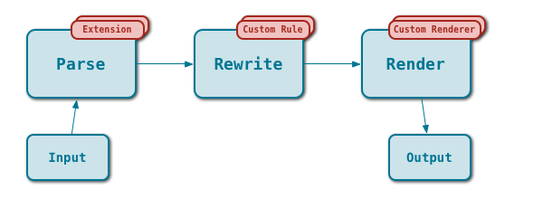

Architecture
============

This page aims to give a very high level overview of the inner workings of Laika.

Understanding the architecture of the toolkit is not required for basic usage.
However if you intend to extend Laika, contribute to it, or if you are simply
curious, then read on.

Design Principles
-----------------

* Fully decouple the aspects of input/output, parsing, rendering, templating and document tree rewriting, 
  making each of these steps pluggable.
  
* Provide a very convenient and simple high level API for common transformation tasks.

* Build a generic document tree model that does not reflect specifics of a particular 
  supported markup language like Markdown or reStructuredText.

* Allow for easy modification of the rendering for a particular node type only, without
  the need to sub-class or modify an existing renderer.
  
* Allow customization of rewrite rules for transforming the document tree before rendering
  (e.g for resolving cross-references).

* Provide concise and type-safe extension APIs for extensible markup definitions.
  
* Create the built-in parsers with the Scala parser combinators, providing efficient and
  reusable base parsers that encapsulate requirements common to all lightweight markup languages,
  while keeping the basic contract for plugging in a new parser function as simple and generic as 
  `Input => Document`, so that other parser frameworks or tools can be used, too.
  
* Designed for robustness: Laika has more than 900 tests, it is protected against malicious
  or accidentally malformed input like endless recursion (a type of guard most other text markup 
  parsers do not include) and parsers like the URI parser are based on the actual relevant RFCs
  (and not just a rough approximation like in many other parsers). 

Transformation Flow
-------------------

This diagram shows the major phases of a transformation with extension hooks shown as little
red boxes:

* `Input` and `Output` are just little IO abstractions, so that the other parts of the system
  do not need to deal with the low-level details of where to read from and to write to. The toolkit
  supports files, strings and streams, writers and readers from `java.io`.
  
* `Parse` represents the actual parsing step, a pluggable function of type `Input => Document` 
  (or `Input => TemplateDocument` for templates).
  Supported out of the box are Markdown and reStructuredText. Other parsers can easily be added
  to the system and they do not need to be based on the SDK's parser combinators like the built-in
  parsers. Parsers can be extended with custom tags called Directives that allow to add new
  constructs to markup without extending the parser.
  
* `Rewrite` is a customizable step for transforming the document tree model before rendering.
  There is always a default rewrite step involved, that looks for nodes in the model that need
  to be resolved, like link references, footnote references, etc. But custom rules can be added
  based on a partial function that deals with specific node types only.
  
* The `Merge` step finally combines the rewritten document tree originating from text markup
  with the document tree from the template, based on the directives used in the template.
  It is basically just a merge of two trees consisting of case classes. The use of templates
  is optional, so this step may get skipped.
  
* `Render` is the final render step. Currently supported out of the box are HTML, PDF, XSL-FO and PrettyPrint,
  the latter visualizing the document tree for debugging purposes. Planned for the next release
  is support for epub. Like with the rewrite step, the entire renderer can be replaced
  by a custom one, or an existing one can customized based on a partial function that deals with
  specific node types only.
